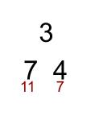
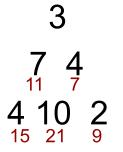

# Project Euler Problem 18 (and 67) Solution

[Project Euler Problem 18](https://projecteuler.net/problem=18) asks one to find the path with the largest sum, when traveling a triangle of numbers. A path must go directly from top to bottom and only the two numbers below are available.

The triangle is provided as a double array, where rows smaller than the base contain zeros to represent the non-terms.

The challenge gives a hint that brute force is a viable solution, however a more efficient method will be required in Problem 67 where the triangle is 100 rows.

I did not try the brute-force method as it did not capture my interest. 

I thought perhaps there could be a way to only calculate the "best" routes, but couldn't think of a clever way to find the "best" routes. Just consider, if one starts at the top and always chooses the largest number below. That only gives you one route. Clearly unless it was a very particular triangle, that would miss a larger route, just because a preceding number was smaller. 

Then I had a breakthrough when I ... 
1 thought of the entire triangle's construction as, one small triangle, with rows added on,
2 considered the pah from the bottom and up. 

I can use these ideas to find the "best' routes **for each node** to the top: ***the max path sum from a node to the top***.

Think of a very small triangle, only two rows. Looking at the bottom row each node (number, term, element, whatever) has a clear, obvious max route as there is only one node above it, the very top row. Say the triangle is only 3 terms: 3, then 7, 4. There are only two routes, which add to 10 and 7 respectively.

  

Easy.

Let's add another row of 4, 10, 2. Each of these nodes must have a max route as well, and we can use the work from the row above to find how large it is. If the route arrives at a node whose max value is already known, we don't need to calculate a max route from there to the top. Which is clear when looking at our very small triangle.

There is only one choice for a max path sum for the 4, it must go to the 7, which we know has a max path sum of 11, so the max path sum for 4 is 4 + 11 = 15. For 10, the route must come from either the 7 or the 4, if it's the max path sum it will arrive from the 7, not because 7 is greater than 4, but because 7's max of 11 is greater than 4's max path sum of 7. So the 10's max path sum is 11 + 10 = 21. The 2 can only be reach via the 4, which as a max path sum of 7, so 2's max path sum is 7 + 2 = 9.

  

This method can be used to find the max path sum for each node on a triangle, as long as you have the max path sums of the nodes above. Funny that the solution doesn't even need to keep track of the actual path, just the sums. Because of that, in my code I just overwrite each node with its max sum.

Once all the max sums are found, the solution is the largest number from the bottom row.

So the solution is kind of like a zen koan. You have to think of the big triangle from the **top** (as a smaller triangle), while seeing it from the **bottom** (of each smaller triangle and subsequent row).

By the way this solution is also valid for [problem 67](https://projecteuler.net/problem=67), finding the max path sum of a 100 row triangle. With that size of a triangle if one were to attempt a brute force solution, a computer *checking one trillion routes every second would take over twenty billion years to solve*.
